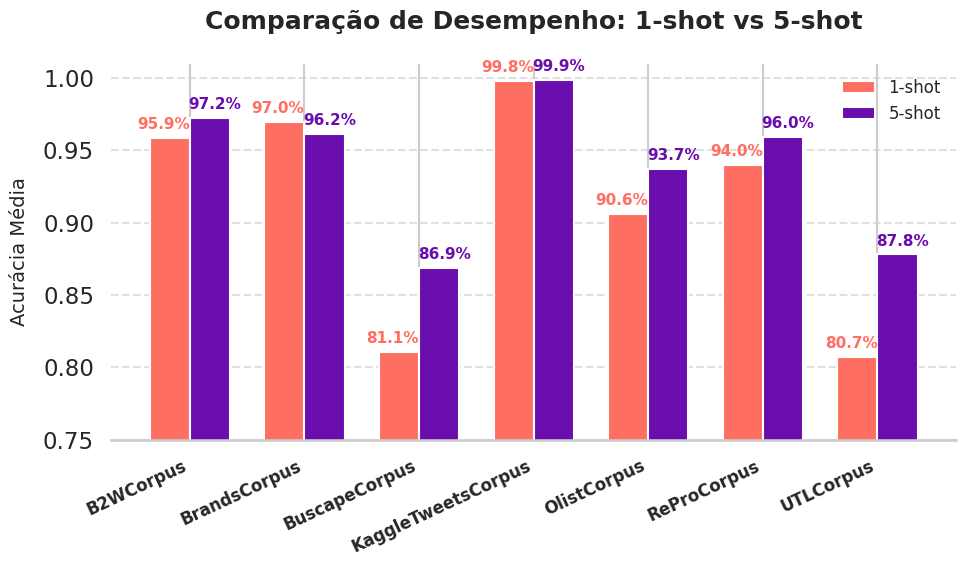

# LAQDA – Aprimorando Meta-Learning para Classificação de Texto Few-Shot

Esse repositório contém o código do **LAQDA**, uma abordagem voltada para melhorar o meta-learning em tarefas de classificação de texto com poucos exemplos (Few-Shot Learning).


## Guia Rápido de Uso

### 1. Criar o Ambiente

```bash
conda create -n LAQDA 
conda activate LAQDA
pip install -r requirements.txt
```

### 2. Executar o Modelo

> **Atenção:** antes de rodar o projeto, é necessário baixar o modelo **bert-base-uncased** disponível em:
> [https://huggingface.co/google-bert/bert-base-uncased](https://huggingface.co/google-bert/bert-base-uncased)
>
> Após o download, atualize o caminho para o modelo dentro do arquivo `run.sh` de acordo com o diretório local onde ele foi salvo.
> Os parâmetros específicos para cada conjunto de dados utilizados no artigo estão definidos no `run.sh`.

```bash
sh run.sh
```

#### Resultados em Datasets PT-BR

A abordagem **LAQDA** também foi avaliada em um conjunto de **datasets brasileiros de reviews e análises de sentimentos**, a fim de verificar sua capacidade de generalização em diferentes idiomas e domínios textuais.
A figura abaixo apresenta a comparação entre os cenários de **1-shot** e **5-shot**.

<p align="center">
  
</p>
<p align="center"><em>Figura 5 – Comparação de desempenho (1-shot vs 5-shot) em datasets PT-BR</em></p>

#### Análise dos Resultados (PT-BR)

Os resultados mostram uma tendência clara de melhoria com o aumento do número de exemplos por classe (de 1-shot para 5-shot), validando a robustez do LAQDA em contextos de língua portuguesa.

* **Consistência entre domínios:** O modelo mantém altas acurácias médias na maioria dos datasets brasileiros, demonstrando que as estratégias de Query-Data-Augmenter (QDA) e Label-Adapter (LA) preservam a qualidade das representações mesmo em textos com gírias e ruídos típicos de avaliações online.

* **Ganho expressivo em cenários desafiadores:** Em datasets mais heterogêneos, como UTLCorpus, há ganhos superiores a 6 pontos percentuais, refletindo a capacidade do LAQDA em ajustar representações quando há aumento do suporte supervisionado.

* **Conclusão geral:** O comportamento observado confirma que o LAQDA não apenas generaliza entre idiomas, mas também mantém sua eficiência em ambientes de linguagem natural informal, típicos do português brasileiro.

