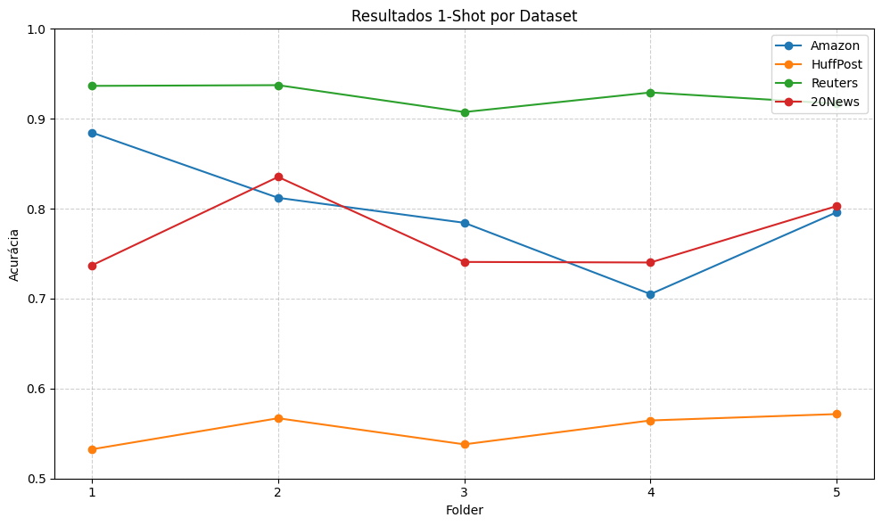
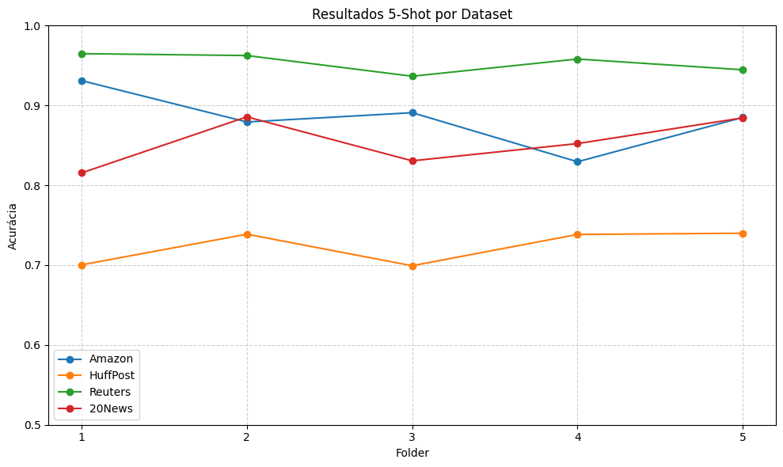
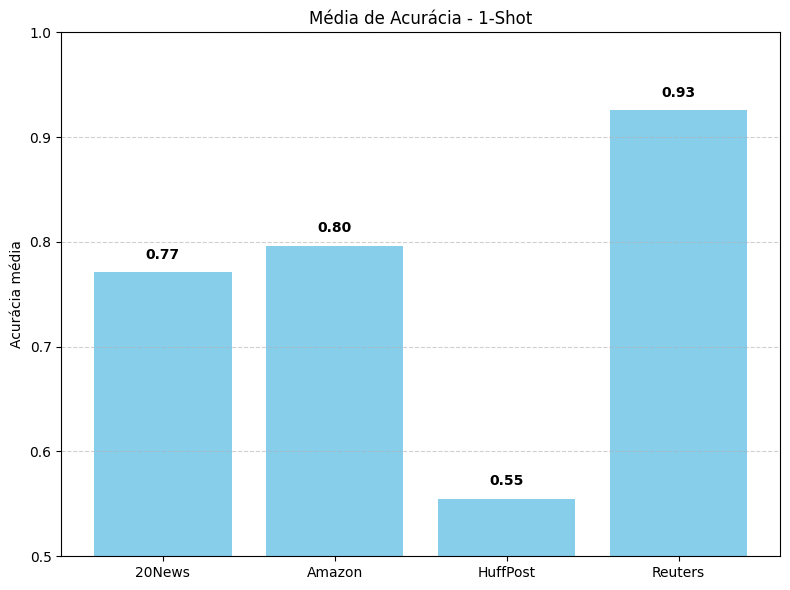
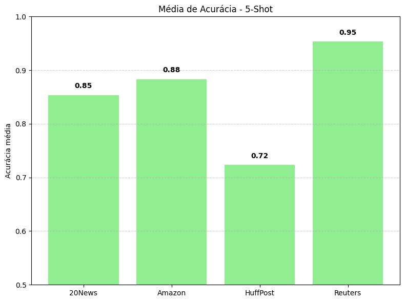

# LAQDA – Aprimorando Meta-Learning para Classificação de Texto Few-Shot

Esse repositório contém o código do **LAQDA**, uma abordagem voltada para melhorar o meta-learning em tarefas de classificação de texto com poucos exemplos (Few-Shot Learning).


## Guia Rápido de Uso

### 1. Criar o Ambiente

```bash
conda create -n LAQDA 
conda activate LAQDA
pip install -r requirements.txt
```

### 2. Executar o Modelo

> **Atenção:** antes de rodar o projeto, é necessário baixar o modelo **bert-base-uncased** disponível em:
> [https://huggingface.co/google-bert/bert-base-uncased](https://huggingface.co/google-bert/bert-base-uncased)
>
> Após o download, atualize o caminho para o modelo dentro do arquivo `run.sh` de acordo com o diretório local onde ele foi salvo.
> Os parâmetros específicos para cada conjunto de dados utilizados no artigo estão definidos no `run.sh`.

```bash
sh run.sh
```

### Resultados

A performance do modelo LAQDA foi avaliada em quatro datasets de classificação de texto amplamente utilizados. A tabela abaixo resume a acurácia média e o desvio padrão (%) calculados a partir de 5 execuções independentes para cada dataset, nos cenários de 1-shot e 5-shot.

| Dataset    | Acurácia (1-shot) | Acurácia (5-shot) |
| :--------- | :---------------- | :---------------- |
| **Amazon** | 79.65% ± 6.88%    | 88.31% ± 3.63%    |
| **HuffPost** | 56.65% ± 1.62%    | 72.34% ± 1.94%    |
| **Reuters** | 92.55% ± 1.25%    | 95.34% ± 1.15%    |
| **20News** | 77.12% ± 4.31%    | 85.37% ± 2.91%    |

<p align="center">
  
  
</p>
<p align="center"><em>Figura 1 – Resultados por pasta (1-shot à esquerda, 5-shot à direita).</em></p>


#### Análise dos Resultados

Os resultados demonstram a eficácia da abordagem LAQDA em melhorar a performance de modelos de meta-learning, especialmente em cenários de extrema escassez de dados (1-shot).

  * **Alto Desempenho em Cenários de 1-shot:** O desempenho notável, especialmente em datasets como **Reuters (92.55%)** e **Amazon (79.65%)**, valida a principal inovação do LAQDA: o **Query-Data-Augmenter (QDA)**. Ao usar os próprios exemplos do conjunto de consulta para refinar um protótipo criado a partir de um único exemplo, o modelo consegue estabilizar e corrigir a representação da classe, mitigando o risco de um único exemplo de suporte ser um outlier e não representativo.

  * **Impacto da Semântica dos Rótulos:** O **Label-Adapter (LA)** contribui para criar um espaço de características mais coeso, onde as classes são mais distinguíveis. Isso é evidenciado pela performance robusta em datasets com classes bem definidas, como o Reuters, onde o desvio padrão baixo indica uma grande estabilidade nos resultados.

  * **Consistência e Generalização:** O modelo apresenta um ganho de performance consistente ao passar de 1-shot para 5-shot em todos os cenários. Isso mostra que, embora seja otimizado para poucos dados, sua capacidade de criar protótipos de qualidade escala bem com o aumento (ainda que pequeno) de informações disponíveis. A variação de performance entre os datasets (ex: HuffPost vs. Reuters) reflete a complexidade intrínseca e a separabilidade das classes em cada um, mas a metodologia LAQDA se prova eficaz em todos eles.

<p align="center">
  
  
</p>
<p align="center"><em>Figura 2 – Acurácia média por dataset (1-shot à esquerda, 5-shot à direita).</em></p>