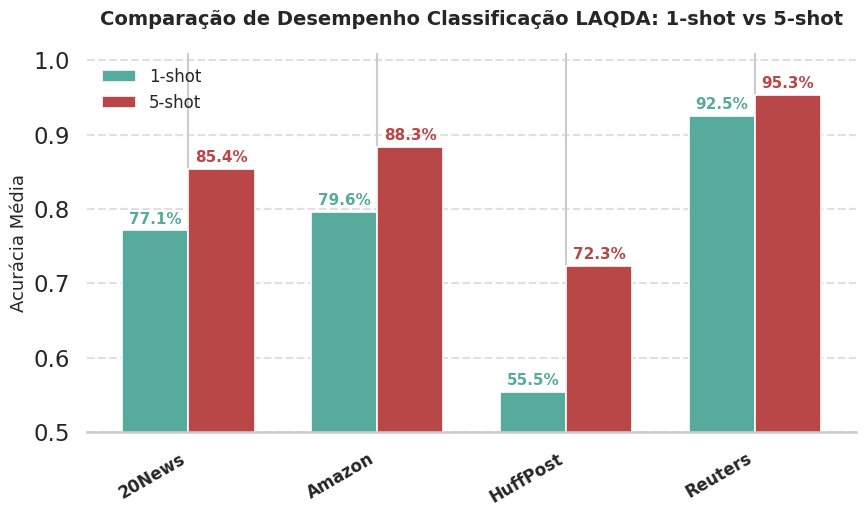
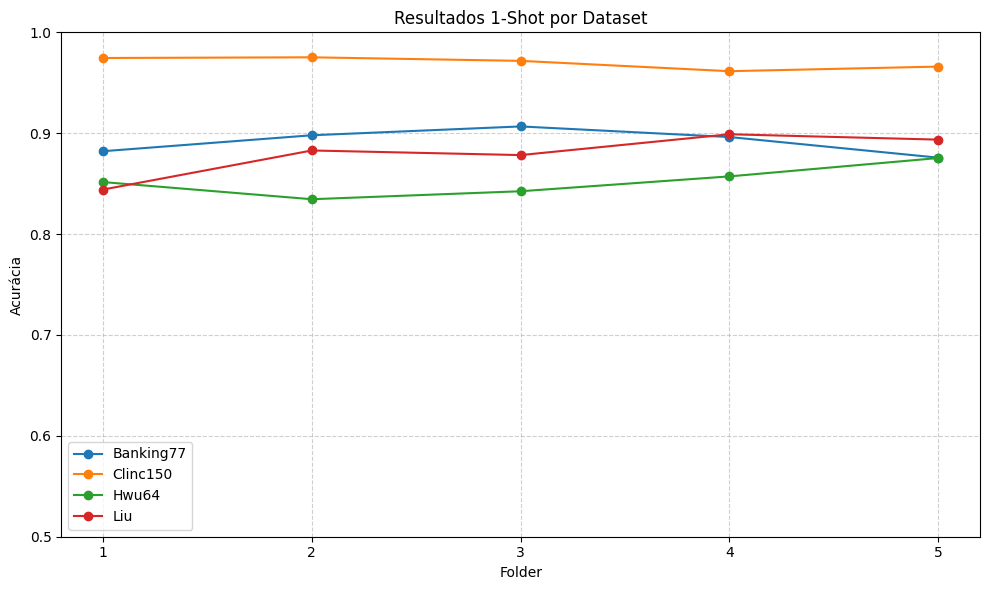
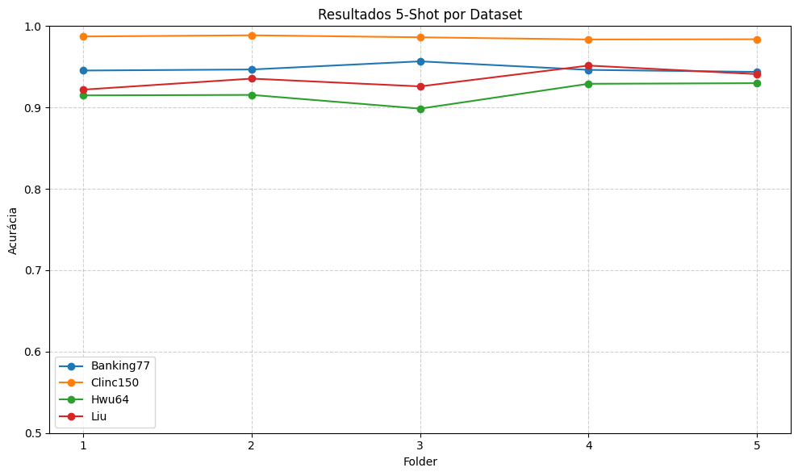

### Resultados Datasets Classificação

A performance do modelo LAQDA foi avaliada em quatro datasets de classificação de texto amplamente utilizados na língua inglesa. A tabela abaixo resume a acurácia média e o desvio padrão (%) calculados a partir de 5 execuções independentes para cada dataset, nos cenários de 1-shot e 5-shot, como forma de tentar reproduzir os resultados do paper original.

| Dataset    | Acurácia (1-shot) | Acurácia (5-shot) |
| :--------- | :---------------- | :---------------- |
| **Amazon** | 79.65% ± 6.88%    | 88.31% ± 3.63%    |
| **HuffPost** | 56.65% ± 1.62%    | 72.34% ± 1.94%    |
| **Reuters** | 92.55% ± 1.25%    | 95.34% ± 1.15%    |
| **20News** | 77.12% ± 4.31%    | 85.37% ± 2.91%    |

  
  

<em>Figura 1 – Resultados por pasta nos datasets de classificação de texto</em>

#### Análise dos Resultados

Os resultados demonstram a eficácia da abordagem LAQDA em melhorar a performance de modelos de meta-learning, especialmente em cenários de extrema escassez de dados (1-shot).

  * **Alto Desempenho em Cenários de 1-shot:** O desempenho notável, especialmente em datasets como **Reuters (92.55%)** e **Amazon (79.65%)**, valida a principal inovação do LAQDA: o **Query-Data-Augmenter (QDA)**. Ao usar os próprios exemplos do conjunto de consulta para refinar um protótipo criado a partir de um único exemplo, o modelo consegue estabilizar e corrigir a representação da classe, mitigando o risco de um único exemplo de suporte ser um outlier e não representativo.

  * **Impacto da Semântica dos Rótulos:** O **Label-Adapter (LA)** contribui para criar um espaço de características mais coeso, onde as classes são mais distinguíveis. Isso é evidenciado pela performance robusta em datasets com classes bem definidas, como o Reuters, onde o desvio padrão baixo indica uma grande estabilidade nos resultados.

  * **Consistência e Generalização:** O modelo apresenta um ganho de performance consistente ao passar de 1-shot para 5-shot em todos os cenários. Isso mostra que, embora seja otimizado para poucos dados, sua capacidade de criar protótipos de qualidade escala bem com o aumento (ainda que pequeno) de informações disponíveis. A variação de performance entre os datasets (ex: HuffPost vs. Reuters) reflete a complexidade intrínseca e a separabilidade das classes em cada um, mas a metodologia LAQDA se prova eficaz em todos eles.

  

<em>Figura 2 – Acurácia média por dataset de Classificação</em>

### Resultados em Datasets de Intenção

A performance do modelo LAQDA também foi avaliada em quatro datasets de classificação de intenção amplamente utilizados. A tabela abaixo resume a acurácia média e o desvio padrão (%) calculados a partir de 5 execuções independentes para cada dataset, nos cenários de 1-shot e 5-shot.

| Dataset       | Acurácia (1-shot) | Acurácia (5-shot) |
| :------------ | :---------------- | :---------------- |
| **Banking77** | 89.18% ± 1.19%    | 94.77% ± 0.52%    |
| **Clinc150**  | 96.98% ± 0.53%    | 98.58% ± 0.20%    |
| **Hwu64**     | 85.22% ± 1.47%    | 91.76% ± 1.33%    |
| **Liu**       | 87.96% ± 1.88%    | 93.50% ± 1.13%    |

  
  

<em>Figura 3 – Resultados por pasta nos datasets de intenção</em>

#### Análise dos Resultados

Os resultados confirmam a robustez do LAQDA em cenários de classificação de intenção:

* **Excelente Desempenho Geral:** Datasets como **Clinc150** atingem quase **97% de acurácia em 1-shot** e superam **98% em 5-shot**, evidenciando que a abordagem lida bem mesmo em tarefas com grande número de intenções distintas.
* **Estabilidade em Dados Complexos:** O **Banking77**, conhecido por possuir intenções semanticamente próximas, manteve acurácias consistentes com **desvio padrão baixo**, o que indica a capacidade do modelo em diferenciar nuances de intenções similares.
* **Impacto do Aumento de Suporte:** Assim como nos datasets de classificação de texto, há **ganhos consistentes ao passar de 1-shot para 5-shot**, com destaque para o Hwu64, que apresentou salto de mais de 6 pontos percentuais, demonstrando que o QDA e o Label-Adapter reforçam representações mesmo em domínios mais desafiadores.

  

<em>Figura 4 – Acurácia média por dataset de intenção</em>
  
